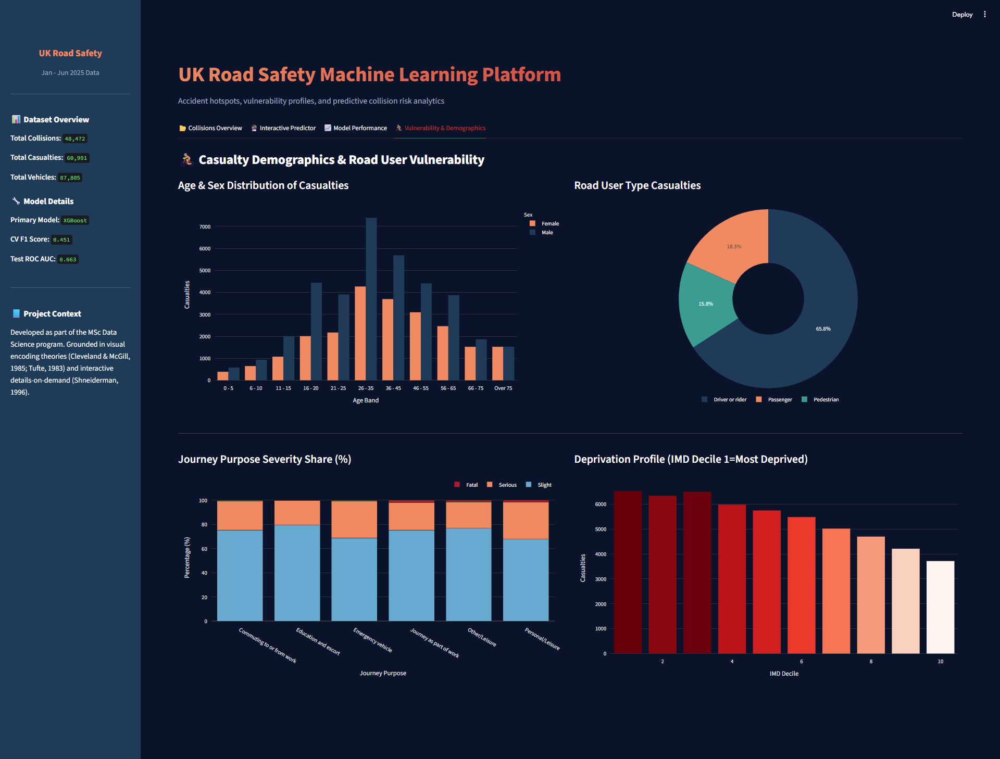

# 🚗 UK Road Safety: Machine Learning & Interactive Analytics Platform

[](https://www.python.org/)
[](https://streamlit.io/)
[](https://xgboost.readthedocs.io/)
[](https://scikit-learn.org/)
[](https://plotly.com/)

An **end-to-end Machine Learning and Interactive Visualisation Platform** designed to analyze and predict road collision severity (Severe/KSI vs. Slight) in the United Kingdom. Powered by the **UK Department for Transport (DfT) STATS19** provisional January–June 2025 road safety dataset, this application translates complex demographic and environmental data into actionable road safety insights.

The platform is designed in accordance with MSc-level data visualization standards and grounded in cognitive design principles (Cleveland & McGill, Tufte, Shneiderman).

---

## 🌌 Live Dashboard Showcase

The dashboard features a premium dark-navy theme with high-contrast accent colors (amber, crimson, teal) to ensure visual clarity and high data-ink ratio. Below are the key tabs of the user interface:

### 1. 📂 Collisions Overview Tab
An aggregate overview of road safety statistics. It features KPI cards, geospatial distribution of collisions, day-of-week temporal heatmaps, daily timelines, and speed limit severity analyses.


### 2. 🔮 Interactive Predictor Tab
An interactive machine learning interface allowing users to input customized collision conditions (speed limit, weather, driver age, involved parties, etc.) and instantly compute the probability of a severe outcome using the trained XGBoost model.


### 3. 📈 Model Performance Tab
A transparent evaluation suite displaying cross-validation comparisons, confusion matrices, feature importance rankings, and ROC curves, demonstrating model trust and performance diagnostics.


### 4. 🚴 Vulnerability & Demographics Tab
A dedicated demographic analysis showing casualties grouped by age, sex, deprivation index (IMD Deciles), and journey purpose severity shares.



---

## 🚀 Key Features

*   **Geospatial Hotspot Mapping**: Interactive Mapbox plot centered on the UK mapping coordinates of 3,000 sampled collisions, sized by casualties and colored by severity.
*   **Temporal Hour-by-Day Heatmap**: Visualizes rush-hour and weekend collision density peaks using a continuous magma color scale.
*   **Real-time Risk Inference**: A serialized XGBoost classification pipeline computes risk probabilities in real time, accompanied by a dynamic gauge chart and a risk category banner.
*   **Explainable ML (XAI)**: Displays Gini-importance scores showing the main predictors of collision severity (e.g., involvement of motorcycles, speed limits, and urban/rural classification).
*   **Demographic Vulnerability Profiles**: Breaks down driver and casualty attributes to identify high-risk groups (e.g., young male drivers, pedestrians in high-deprivation areas).

---

## 🧠 Machine Learning Pipeline

The prediction task is framed as a **binary classification** problem: predicting whether an accident will result in a **Severe** (Fatal or Serious, also known as Killed or Seriously Injured - KSI) vs. **Slight** outcome.

### 1. Data Processing & Pipeline Architecture
*   **Numeric Features** (`speed_limit`, `hour`, `number_of_vehicles`, driver/casualty age bounds): Imputed with the median and normalized using `StandardScaler`.
*   **Categorical Features** (`urban_or_rural_label`, `light_conditions_label`, `weather_conditions_label`, `road_surface_conditions_label`, `day_of_week_label`): Imputed with the mode and encoded via `OneHotEncoder`.
*   **Class Imbalance Resolution**: The dataset contains an imbalanced split (~74% Slight, ~26% Severe). Imbalance is resolved by setting `scale_pos_weight = 2.83` in the XGBoost classifier and applying balanced class weights in Random Forest.

### 2. Model Performance Summary
Evaluated using **5-Fold Stratified Cross-Validation** on the holdout test set:

| Model Classifier | CV Mean F1-Score | Test F1-Score | Test ROC-AUC |
| :--- | :---: | :---: | :---: |
| **XGBoost Classifier (Selected)** | **0.451** | **0.440** | **0.663** |
| **Random Forest Classifier** | 0.439 | 0.452 | 0.659 |

> [!NOTE]
> Predicting severity solely from external environmental factors is highly challenging due to noise. An F1-Score of **0.44** on the minority class represents a statistically significant predictive indicator compared to random guessing (0.26 baseline).

---

## 📂 Repository Structure

```filepath
├── app.py                      # Streamlit application (Frontend, layouts, and forms)
├── train_model.py              # Pipeline construction, training, and evaluation script
├── model_training.ipynb        # Diagnostic notebook with evaluation plots
├── road_safety_model.joblib    # Serialized scikit-learn preprocessing & XGBoost model
├── model_metadata.json         # Saved metrics, confusion matrix, and feature importances
├── .streamlit/
│   └── config.toml             # Custom styling and premium dark theme overrides
├── Datasets/
│   ├── dft-road-casualty-statistics-collision-provisional-2025 (1).csv  # Collisions
│   ├── dft-road-casualty-statistics-casualty-provisional-2025.csv       # Casualties
│   └── dft-road-casualty-statistics-vehicle-provisional-2025.csv        # Vehicles
└── README.md                   # Project documentation
```

---

## 🛠️ Installation & Usage

### 1. Clone & Setup Environment
Ensure Python 3.10+ is installed. Clone the repository and install all required dependencies:
```bash
pip install pandas numpy scikit-learn xgboost streamlit plotly matplotlib seaborn openpyxl joblib
```

### 2. Run the Streamlit Dashboard
Launch the interactive web platform:
```bash
streamlit run app.py
```
Open your browser and navigate to **`http://localhost:8501`** to interact with the dashboard.

### 3. Retrain the Machine Learning Models (Optional)
To run the full training pipeline, re-evaluate datasets, and overwrite the cached metadata:
```bash
python train_model.py
```

---

## 📚 Theoretical Design Foundations

The dashboard is built to comply with high-level academic visual representation standards:
*   **Shneiderman’s Visual Information Seeking Mantra (1996)**: *"Overview first, zoom and filter, then details-on-demand."* The platform starts with broad KPI aggregates, filters datasets via interactive elements, and reveals detailed counts via Plotly tooltips.
*   **Cleveland & McGill (1985)**: Spatial position along a common scale is prioritized (e.g., using grouped bar charts for age and sex comparisons) to minimize user cognitive load.
*   **Tufte (1983)**: Maximizes the data-ink ratio by removing non-essential gridlines, borders, and browser-default "chart junk," utilizing transparent backgrounds for Plots.
*   **Color Encoding**: Diverging and sequential color palettes (magma, blues, reds) are mapped to continuous gradients to communicate risk scale intuitively without causing visual distortion.

---

*Developed as part of the MSc Data Science Program.*
